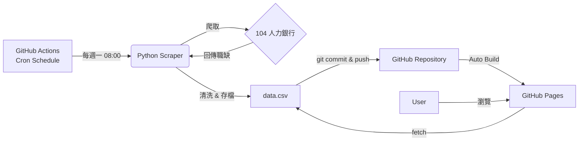

# [實戰] 我如何用 GitHub Actions + Python 打造每週自動更新的「專屬求職儀表板」 ($0成本)

找工作是一場耐力賽。特別是在 AI 與數位轉型變動如此快速的時代，每天手動刷求職網站，不僅效率低，更容易產生「我是不是錯過了什麼好機會」的資訊焦慮。

身為一名推崇自動化的開發者，我常想：**「與其我每天去找工作，為什麼不能讓工作每週以此自動整理好，送到我面前？」**

於是我花了一個週末，利用 **GitHub Actions** 加上 **Python**，打造了一個**零成本 (Zero Cost)**、**全自動 (Fully Automated)**，且**高度客製化**的個人求職儀表板。

這篇文章將分享我如何設計這個系統，以及你如何也能用同樣的架構，打造屬於自己的數據儀表板。

---

## 核心哲學：極簡與免費 (KISS & Serverless)

在設計架構時，我給自己訂了幾個原則：
1.  **$0 成本**：不需要租 AWS、GCP 或任何 VPS。
2.  **無伺服器 (Serverless)**：我不想維護任何 Backend API SERVER。
3.  **自動化**：部署後就不需要再手動介入，它必須自己活著。

基於這些原則，我選擇了以下的技術堆疊：

*   **運算 (Compute)**: GitHub Actions (每週排程執行)
*   **核心 (Core)**: Python + Scrapy (資料抓取)
*   **資料庫 (Database)**: CSV 檔案 (直接存在 Git Repo 中)
*   **前端 (Frontend)**: GitHub Pages + Chart.js (靜態託管)

### 架構流程圖



這是一個典型的「以 Git 為中心」的資料流。我們利用 Git 的版本控制特性來儲存資料更新，雖然這不適合大規模的即時應用，但對於「每週更新一次」的個人儀表板來說，這是最優雅且免費的解法。

---

## 實作細節拆解

### 1. 數據抓取：Python Scraper

我選擇 Python 的 `Scrapy` 框架，因為它在處理大量頁面請求時非常高效，且結構清晰。

在爬蟲策略上，我專注於抓取我最在意的欄位，這也是自建工具最大的優勢：**你可以定義自己的「黃金數據」**。
*   **薪資範圍 (`salaryLow`, `salaryHigh`)**：把為了排序用的隱藏欄位抓出來。針對「4萬以上」這種只有底薪的職缺，我還寫了一個小邏輯：**自動將底薪乘上 1.2 倍作為估算薪資**，避免統計結果被低估。
*   **遠端與否 (`remoteWorkType`)**：這在官網上有時藏得很深，但我直接將它提取為一級篩選條件。
*   **技能關鍵字**：利用 NLP 簡單處理描述，提取出 "Python", "RPA", "GenAI" 等關鍵字。

### 2. 自動化的心臟：GitHub Actions

這是讓專案「活起來」的關鍵。透過 `.github/workflows/weekly-update.yml`，我設定了每週一早上 8:00 (台灣時間) 自動執行。

關鍵配置分享：

```yaml
name: Weekly Job Data Update

on:
  schedule:
    # Cron 表達式：每週一 UTC 00:00 (台灣 08:00)
    - cron: '0 0 * * 1'
  workflow_dispatch: # 保留手動觸發按鈕，方便測試

jobs:
  update-data:
    runs-on: ubuntu-latest
    steps:
    - uses: actions/checkout@v3
    
    - name: Set up Python
      uses: actions/setup-python@v4
      with:
        python-version: '3.10'
        
    - name: Run Scraper
      run: |
        pip install -r requirements.txt
        python update_dashboard.py
        
    - name: Commit and push if changed
      run: |
        git config --global user.name 'JobBot'
        git config --global user.email 'bot@example.com'
        git add data.csv
        # 只有當資料有變動時才 Commit，避免無效紀錄
        git diff --quiet && git diff --staged --quiet || (git commit -m "🤖 Auto-update job data" && git push)
```

這段腳本不僅負責執行爬蟲，還包含了一個 `git commit` 的動作。這意味著：**GitHub Actions 其實就是你的寫入端 (Writer)，而 Repository 本身就是你的資料庫。**

### 3. 前端儀表板：No-Backend 的魔法

有了 `data.csv`，前端怎麼辦？需要寫一個 API 來讀它嗎？
**完全不用。**

由於 GitHub Pages 本身就是一個靜態檔案伺服器，你的 `data.csv` 本身就有一個公開的 URL。我們只需要在 HTML 中用 JavaScript 的 `fetch()` 抓取這個 CSV 檔，再用 `Chart.js` 渲染即可。

```javascript
// 簡單到不可思議的 Backend-less 邏輯
async function loadData() {
    const response = await fetch('./data.csv');
    const csvText = await response.text();
    const jobs = parseCSV(csvText); // 簡單的 CSV 解析器
    
    renderCharts(jobs); // 畫圖
}
```

這個設計帶來了極致的載入速度，因為瀏覽器只是下載一個純文字檔，剩下的運算都在 Client 端完成。

---

## 成果：屬於我的市場洞察

經過幾週的自動運行，這個儀表板給了我很多官網看不到的洞察：

1.  **真實薪資分佈**：Dashboard 自動畫出的「常態分佈鐘形圖」，讓我一眼就能看出目前市場開價的「中位數」落在哪裡，而在談薪水時更有底氣。
2.  **技能趨勢**：透過文字雲與長條圖，我發現「AI 工程師」職缺中，除了 Python 之外，**"RPA" (流程自動化)** 與 **"Edge Computing"** 的出現頻率比我想像中高很多，這成為我接下來學習清單的參考。
3.  **遠端工作的真相**：雖然很多職缺標榜「彈性」，但在我的「遠端模式圓餅圖」中，真正的 **"Fully Remote"** 其實不到 10%。這讓我能快速過濾掉不符合期望的職缺。

## 結語

在這個專案中，我們沒有花一毛錢，沒有維護任何一台伺服器，卻得到了一個 24 小時待命、每週準時回報的求職代理人。

這就是技術的力量。它不只是用來解決公司的問題，更可以用來**優化我們自己的生活**。

如果你也正在找工作，或是對市場趨勢感興趣，不妨也動手試試看與其焦慮地刷網頁，不如讓資料主動來找你。
